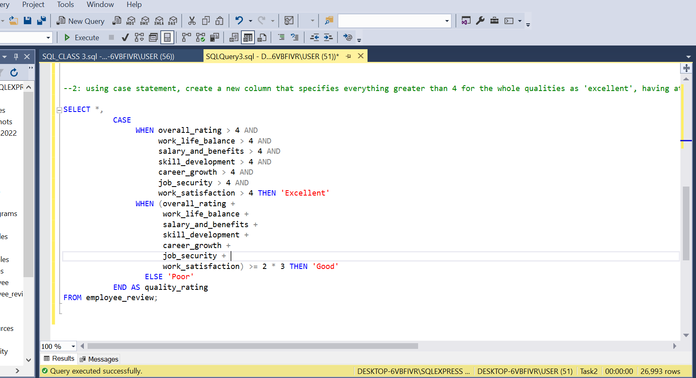

# employee_review

## Introduction
	This project is an SQl project, the dataset is called Student Record. I created a database for student records and created Three (3) tables in the database. Some alteration were later made to some columns in some tables.
 
**_Disclamier_**:_All Dataset do not represent any individual, Institution or company ,but just a dummy set to demonstrate my knowledge of SQL_.

## Problem Statement
- Find the job title in the "Software developement" department that have a work life balance rating greater than 4 and a salary and benefits rating greater than 4.5.
- NB: Endeavour to check whether there are null values in work_life_balance column and the salary_and_benefit rating and do the needful (fill with average).

- Using case statement, create a new column that specifies everything greater than 4 for the whole qualities as 'excellent', having atleast two qualities greater than 3 as 'Good' and everyother thing as 'poor'.

## Skill documented
These are some of the Sql Features used;
1. Data cleaning
2. Updating Table

# Problem Solved

--: Find the job title in the "Software developement" department that have a work life balance rating greater than 4 and a salary and benefits rating greater than 4.5

- I Frist check if there null values for work life balance and salary and benefits for software development department. with this syntax;
 
SELECT DISTINCT WORK_LIFE_BALANCE FROM employee_review;

SELECT DISTINCT salary_and_benefits FROM employee_review;

There was null in both,I fill the null value with the average value for both. With this syntax;

 
 
For work life balance;
SELECT ROUND(AVG(work_life_balance), 0) FROM EMPLOYEE_REVIEW;

SELECT DISTINCT REPLACE(work_life_balance, NULL, 4) FROM EMPLOYEE_REVIEW WHERE work_life_balance IS NULL;

UPDATE EMPLOYEE_REVIEW

SET work_life_balance = 4

WHERE work_life_balance IS NULL; 

--Salary_benefit

SELECT ROUND(AVG(salary_and_benefits), 0) FROM EMPLOYEE_REVIEW;

SELECT DISTINCT REPLACE(salary_and_benefits, NULL, 3) FROM EMPLOYEE_REVIEW WHERE salary_and_benefits IS NULL;

UPDATE EMPLOYEE_REVIEW

SET salary_and_benefits = 3

WHERE salary_and_benefits IS NULL; 

SELECT DISTINCT salary_and_benefits FROM employee_review;

SELECT Title,Department,work_life_balance,salary_and_benefits

From employee_review where Department = 'software development department' AND work_life_balance > 4 AND salary_and_benefits > 4.5;

SELECT Title,Department

From employee_review where Department = 'software development department';

# Conclusion

There are 26,993 employee in the company;

There are 8,936 employee in sofware develpment department;

Just 1342 Software developer has there  work life balance rating greater than 4 and a salary and benefits rating greater than 4.5.

 Compare to the number of all the software developer this is very low, the company should look into it.

- Using case statement, create a new column that specifies everything greater than 4 for the whole qualities as 'excellent', having atleast two qualities greater than 3 as 'Good' and everyother thing as 'poor'.

  This is the Syntax Used:
  
    SELECT *,
  
               CASE
                    WHEN overall_rating > 4 AND
  
                     work_life_balance > 4 AND
  
                     salary_and_benefits > 4 AND
                     
                     skill_development > 4 AND
  
                     career_growth > 4 AND
  
                     job_security > 4 AND
  
                     work_satisfaction > 4 THEN 'Excellent'
  
                WHEN (overall_rating +
  
                      work_life_balance +
  
                      salary_and_benefits +
  
                      skill_development +
  
                      career_growth +
  
                      job_security +
  
                      work_satisfaction) >= 2 * 3 THEN 'Good'
  
                  ELSE 'Poor'
  
           END AS quality_rating
  
FROM employee_review;

  

  

           

Alter table employee_review add Quality_rating varchar (50);

Update employee_review

Set Quality_rating = CASE

                WHEN overall_rating > 4 AND 
                
                     work_life_balance > 4 AND 
                     
                     salary_and_benefits > 4 AND 
                     
                     skill_development > 4 AND 
                     
                     career_growth > 4 AND 
                     
                     job_security > 4 AND 
                     
                     work_satisfaction > 4 THEN 'Excellent'
                     
                WHEN (overall_rating + 
                
                      work_life_balance + 
                      
                      salary_and_benefits + 
                      
                      skill_development + 
                      career_growth + 
                      
                      job_security + 

                      
                      work_satisfaction) >= 2 * 3 THEN 'Good'
                  ELSE 'Poor'
                  
           END;

1.	We use a CASE statement for each of the seven columns to check if each column is greater than 4, and if all columns meet this condition, it's categorized as 'Excellent'.
2.	We calculate the sum of the values in these seven columns and check if the sum is greater than or equal to 2 times 3 (since you want at least two qualities greater than 3 to be categorized as 'Good'). If this condition is met, it's categorized as 'Good'.
3.	If neither of the above conditions is met, it's categorized as 'Poor'.
This query will create a new column named "quality_rating" in the result set that categorizes the data based on your specified criteria for the seven columns.

 

